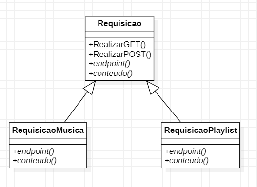

# Template Method

Cria super-classe com tudo, e o que for específico passa pra sub-classes.  
Criar literalmente um template de algo;

**Caso de uso:** Executar requisições via API  
Template é de GET e POST. O conteúdo do request e a URL muda de acordo com o uso da sub-classe.

